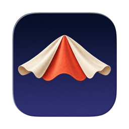
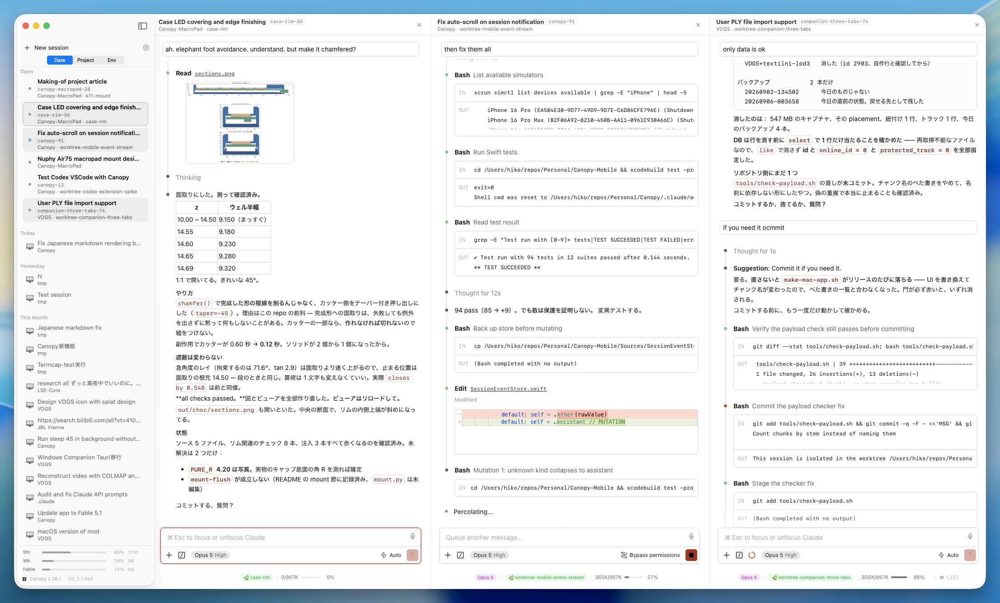

[English](README.md) | 日本語

# Canopy

<p align="center">
  
  <br>
  <a href="https://docs.anthropic.com/en/docs/claude-code">Claude Code</a> をネイティブ macOS アプリで使える — VSCode 不要。Claude Code 拡張機能の UI をそのまま macOS ウィンドウで動かします。
</p>

<p align="center">
  
</p>

## 特徴

- **ネイティブ macOS ウィンドウ** — Claude Code の React UI を WKWebView で表示
- **ランチャー** — ディレクトリ選択、最近のディレクトリ、セッション履歴、モデル/エフォート/パーミッション選択
- **サイドバーシェル** — セッションは左サイドバーに常駐し、詳細ペインがその場で webview を差し替える
- **分割ビュー** — 最大 5 ペインを横に並べ、Cmd+1–9 でフォーカス、ディバイダのドラッグでリサイズ
- **セッション再開** — 過去のセッションを履歴の即時リプレイで再開
- **SSH リモート** — リモートマシン上の Claude CLI を SSH 経由で実行
- **リアルタイムストリーミング** — 思考、テキスト、ツール使用をライブ表示
- **自動アップデート** — Sparkle によるデルタアップデート対応
- **MacroPad** — 各ペインの状態を LED で示し、キーを押すとそのペインへ飛ぶ外付け USB キーパッド（任意）。返事待ちのセッションが画面を見ずに分かる（ファームウェア: [Canopy-MacroPad](https://github.com/Saqoosha/Canopy-MacroPad) — 現在は非公開リポジトリ）
- **キーボードショートカット** — Cmd+N（新規セッション）、Cmd+O（フォルダを開く）、Cmd+1–9（ペインをフォーカス）、Cmd+Opt+←/→（フォーカス移動）
- **カスタムスタイル** — タイポグラフィ、コードブロック、シンタックスハイライトを調整し、ネイティブ macOS に馴染む見た目に

## 必要なもの

- macOS 15.0 (Sequoia) 以降
- [Claude Code VSCode 拡張機能](https://marketplace.visualstudio.com/items?itemName=anthropic.claude-code)
- [Claude CLI](https://docs.anthropic.com/en/docs/claude-code)（`claude auth login` で認証済み）
- Node.js 18+

---

## 開発

### 必要なもの

- Xcode 16.0+
- [XcodeGen](https://github.com/yonaskolb/XcodeGen)

### ソースからビルド

```bash
git clone https://github.com/Saqoosha/Canopy.git
cd Canopy
xcodegen generate
xcodebuild -scheme Canopy -configuration Debug -derivedDataPath build build

# アプリの場所:
# build/Build/Products/Debug/Canopy.app
```

### アーキテクチャ

```
WKWebView ─── postMessage ──→ ShimProcess.swift
                                  │ stdin/stdout NDJSON
                                  ▼
                              Node.js subprocess
                                  ├─ vscode-shim/ (10 JS modules)
                                  │    └─ intercepts require("vscode")
                                  └─ extension.js (CC extension, unmodified)
                                       └─ spawns Claude CLI via child_process
```

CC 拡張機能の `extension.js` を未改変のまま Node.js サブプロセスで実行。vscode-shim が `require("vscode")` を横取りし、NDJSON（stdin/stdout）経由で webview とブリッジ。拡張機能が Claude CLI をストリーミング JSON モードで起動し、SSE イベントがそのまま webview に流れる。

SSH リモートでは、ラッパースクリプトが CLI の起動を置き換え、SSH 経由でリモートマシン上の `claude` を実行。

### プロジェクト構成

```
Sources/Canopy/
  CanopyApp.swift              SwiftUI アプリエントリ、ペイン、メニュー、Sparkle アップデーター
  SessionActivity.swift        サイドバーのドットと MacroPad の LED が共有する状態分類
  MacroPad/                    USB キーパッド: ワイヤプロトコル、シリアルデバイス、状態コントローラ
  AppState.swift               状態管理、PermissionMode enum、画面遷移
  ShimProcess.swift            Node.js サブプロセス管理、NDJSON ブリッジ、認証パッチ
  NodeDiscovery.swift          Node.js >= 18 の検出 (Homebrew, mise, nvm, login shell)
  LauncherView.swift           ランチャー: ディレクトリ選択、履歴
  WebViewContainer.swift       WKWebView セットアップ、CSS インジェクション
  ClaudeSessionHistory.swift   セッション JSONL パーサー
  StatusBarView.swift          ネイティブステータスバー: コンテキスト使用量、モデル、レート制限
  ContentViewer.swift          Monaco エディタオーバーレイ
  theme-light.css              VSCode CSS 変数 456 個 (Default Light+)

Resources/
  vscode-shim/                 VSCode API を shim する Node.js モジュール群
  ssh-claude-wrapper.sh        SSH リモート用ラッパースクリプト
  canopy-overrides.css         カスタムスタイル: タイポグラフィ、コードブロック、WKWebView 修正
  prism-canopy.css             シンタックスハイライトテーマ (Prism.js, Claude Desktop 風配色)
```

### テスト

```bash
# ユニットテスト
node --test test/shim-unit.test.js

# インテグレーションテスト (CC 拡張機能が必要)
node --test --test-timeout 120000 test/shim-integration.test.js
```

### リリース

```bash
# フルリリース: ビルド、署名、公証、DMG、GitHub Release、Sparkle appcast
./scripts/release.sh 1.0.2

# appcast のみ更新 (GitHub Release のノート編集後)
./scripts/update_appcast.sh 1.0.2
```

### サードパーティライブラリ

- [Sparkle](https://github.com/sparkle-project/Sparkle) — macOS 用自動アップデートフレームワーク

## ライセンス

MIT
