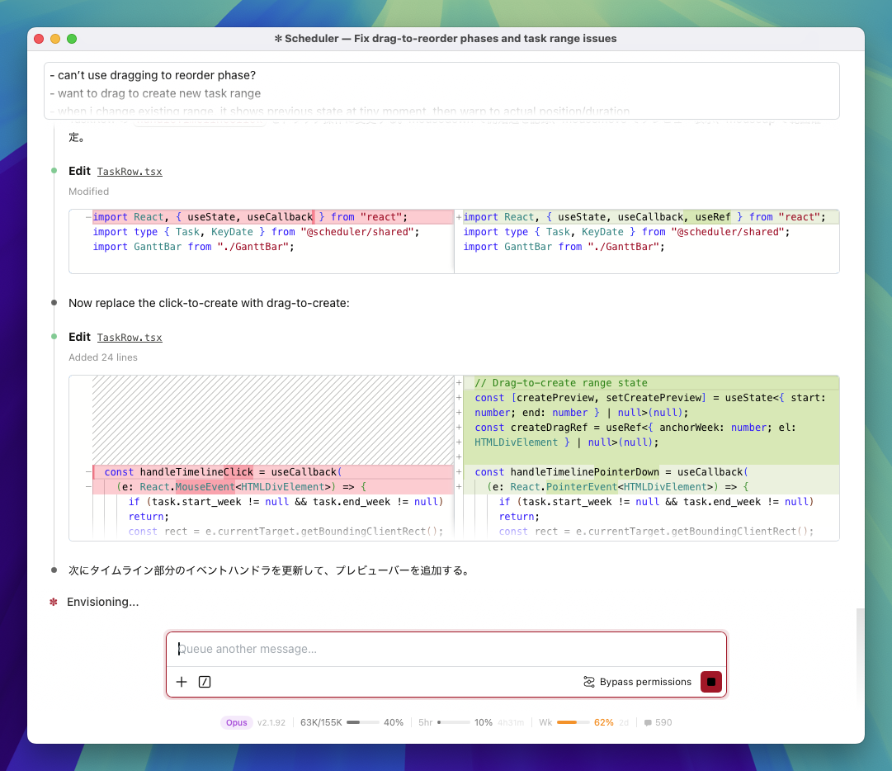

English | [日本語](README.ja.md)

# Canopy

<p align="center">
  
  <br>
  A standalone macOS app for <a href="https://docs.anthropic.com/en/docs/claude-code">Claude Code</a> — no VSCode required. Runs the Claude Code extension's UI natively in a macOS window.
</p>

<p align="center">
  
</p>

## Features

- **Native macOS window** — Claude Code's full React UI in a WKWebView
- **Launcher** — directory picker, recent directories, session history, model/effort/permission selectors
- **Tabs** — Cmd+T for new tabs, Cmd+1–9 to switch
- **Session resume** — pick up where you left off with instant history replay
- **SSH remote** — run Claude CLI on remote machines via SSH
- **Real-time streaming** — thinking, text, tool use, all streamed live
- **Auto-update** — Sparkle with delta updates
- **Keyboard shortcuts** — Cmd+N (launcher), Cmd+O (open folder), Cmd+T (new tab)

## Requirements

- macOS 15.0 (Sequoia) or later
- [Claude Code VSCode extension](https://marketplace.visualstudio.com/items?itemName=anthropic.claude-code) installed
- [Claude CLI](https://docs.anthropic.com/en/docs/claude-code) installed and authenticated (`claude auth login`)
- Node.js 18+

---

## Development

### Architecture

```
WKWebView ─── postMessage ──→ ShimProcess.swift
                                  │ stdin/stdout NDJSON
                                  ▼
                              Node.js subprocess
                                  ├─ vscode-shim/ (10 JS modules)
                                  │    └─ intercepts require("vscode")
                                  └─ extension.js (CC extension, unmodified)
                                       └─ spawns Claude CLI via child_process
```

Canopy runs the CC extension's `extension.js` unmodified in a Node.js subprocess. A vscode-shim intercepts `require("vscode")` calls and bridges the webview via NDJSON over stdin/stdout. The extension spawns the Claude CLI in streaming JSON mode — SSE events flow through the shim directly to the webview.

For SSH remote, a wrapper script replaces the CLI spawn to run `claude` on the remote machine via SSH.

### Requirements

- Xcode 16.0+
- [XcodeGen](https://github.com/yonaskolb/XcodeGen)

### Build from Source

```bash
git clone https://github.com/Saqoosha/Canopy.git
cd Canopy
xcodegen generate
xcodebuild -scheme Canopy -configuration Debug -derivedDataPath build build

# The app is located at:
# build/Build/Products/Debug/Canopy.app
```

### Project Structure

```
Sources/Canopy/
  CanopyApp.swift              SwiftUI app entry, tabs, menu commands, Sparkle updater
  AppState.swift               Observable state, PermissionMode enum, screen transitions
  ShimProcess.swift            Node.js subprocess manager, NDJSON bridge, auth/permission patching
  NodeDiscovery.swift          Finds Node.js >= 18 (Homebrew, mise, nvm, login shell)
  LauncherView.swift           Launcher: directory picker, recent dirs, session history
  WebViewContainer.swift       WKWebView setup, CC webview loading, CSS injection
  ClaudeSessionHistory.swift   Session JSONL parser, chain walking, cwd extraction
  StatusBarView.swift          Native status bar: context usage, model, rate limits
  ContentViewer.swift          Monaco editor overlay for viewing file contents
  theme-light.css              456 VSCode CSS variables (Default Light+)

Resources/
  vscode-shim/                 Node.js modules that shim the VSCode API
  ssh-claude-wrapper.sh        SSH remote wrapper script
```

### Tests

```bash
# Unit tests
node --test test/shim-unit.test.js

# Integration tests (needs CC extension installed)
node --test --test-timeout 120000 test/shim-integration.test.js
```

### Release

```bash
# Full release: build, sign, notarize, DMG, GitHub release, Sparkle appcast
./scripts/release.sh 1.0.2

# Update appcast only (after editing GitHub Release notes)
./scripts/update_appcast.sh 1.0.2
```

## Third-Party Libraries

- [Sparkle](https://github.com/sparkle-project/Sparkle) — Auto-update framework for macOS

## License

MIT
