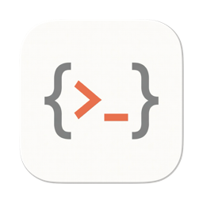

# Canopy

<p align="center">
  
  <br>
  A standalone macOS app that hosts the <a href="https://docs.anthropic.com/en/docs/claude-code">Claude Code</a> VSCode extension's webview UI in a native WKWebView window — no VSCode required.
</p>

## Features

- **Launcher screen** with directory picker, recent directories, and session history
- **Tabbed interface** — Cmd+T for new tabs, Cmd+1–9 to switch, native macOS window tabbing
- **Session management** — resume past sessions with instant history replay
- **Permission mode selection** — Default, Accept Edits, Plan, or Bypass All
- **Real-time streaming** — SSE event forwarding (thinking, text deltas, tool use) from CLI to webview
- **Auto-update** — Sparkle integration with delta updates and embedded release notes
- Native macOS window running the Claude Code extension UI (React 18 + Preact Signals)
- Real authentication via macOS Keychain (same source as the VSCode extension)
- VSCode Light+ theme with 456 CSS variables exported from a real VSCode instance
- Safari Web Inspector support for debugging the webview
- **Keyboard shortcuts** — Cmd+N (back to launcher), Cmd+O (open folder), Cmd+T (new tab)

## Requirements

- macOS 15.0 (Sequoia) or later
- [Claude Code VSCode extension](https://marketplace.visualstudio.com/items?itemName=anthropic.claude-code) installed (provides the webview assets)
- [Claude CLI](https://docs.anthropic.com/en/docs/claude-code) installed and authenticated (`claude auth login`)
- Node.js 18+ (for the vscode-shim subprocess)

## Build from Source

```bash
# Requirements: Xcode 16+, XcodeGen
xcodegen generate
xcodebuild -scheme Canopy -configuration Debug -derivedDataPath build build
open build/Build/Products/Debug/Canopy.app
```

Or open `Canopy.xcodeproj` in Xcode and build/run from there.

## How It Works

```
WKWebView ─── postMessage ──→ ShimProcess.swift
                                  │ stdin/stdout NDJSON
                                  ▼
                              Node.js subprocess
                                  ├─ vscode-shim/ (10 JS modules)
                                  │    └─ intercepts require("vscode")
                                  └─ extension.js (CC extension, unmodified)
                                       └─ spawns Claude CLI via child_process
```

1. Canopy shows a **launcher screen** where you pick a working directory and permission mode
2. A Node.js subprocess runs the CC extension's `extension.js` unmodified, with a vscode-shim that intercepts `require("vscode")` calls
3. The webview communicates with the shim via NDJSON over stdin/stdout, bridged by `ShimProcess.swift`
4. The extension spawns the `claude` CLI in streaming JSON mode — SSE events flow through the shim directly to the webview
5. When resuming a session, history is replayed via synchronous `dispatchEvent` for instant rendering

## Project Structure

```
Sources/Canopy/
  CanopyApp.swift              SwiftUI app entry, tabs, menu commands, Sparkle updater
  AppState.swift               Observable state, PermissionMode enum, screen transitions
  ShimProcess.swift            Node.js subprocess manager, NDJSON bridge, auth/permission patching
  NodeDiscovery.swift          Finds Node.js >= 18 (Homebrew, mise, nvm, login shell)
  LauncherView.swift           Welcome screen: directory picker, recent dirs, session history
  WebViewContainer.swift       WKWebView setup, CC webview loading, CSS injection
  ClaudeSessionHistory.swift   Session JSONL parser, chain walking, cwd extraction
  RecentDirectories.swift      MRU directory list (UserDefaults)
  VSCodeStub.swift             acquireVsCodeApi() JS stub, theme CSS loader
  CCExtension.swift            Extension/CLI path discovery
  ContentViewer.swift          Monaco editor overlay for viewing file contents
  theme-light.css              456 VSCode CSS variables (Default Light+)

Resources/vscode-shim/         Node.js modules that shim the VSCode API for extension.js
```

## Release

```bash
# Full release: build, sign, notarize, DMG, GitHub release, Sparkle appcast
./scripts/release.sh 1.0.2

# Update appcast only (after editing GitHub Release notes)
./scripts/update_appcast.sh 1.0.2
```

## Third-Party Libraries

- [Sparkle](https://github.com/sparkle-project/Sparkle) — Auto-update framework for macOS

## License

MIT
