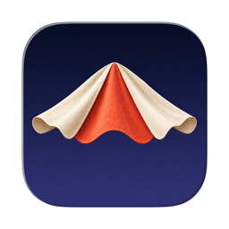
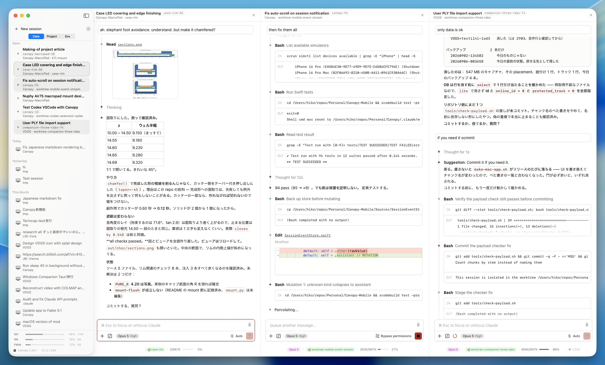

English | [日本語](README.ja.md)

# Canopy

<p align="center">
  
  <br>
  A standalone macOS app for <a href="https://docs.anthropic.com/en/docs/claude-code">Claude Code</a> — no VSCode required. Runs the Claude Code extension's UI natively in a macOS window.
</p>

<p align="center">
  
</p>

## Features

- **Native macOS window** — Claude Code's full React UI in a WKWebView
- **Launcher** — directory picker, recent directories, session history, model/effort/permission selectors, GitHub clone, and a "start in a new worktree" toggle
- **Sidebar shell** — sessions live in a persistent left sidebar; the detail pane swaps the active webview in place
- **Split view** — up to 6 panes side by side, Cmd+1–9 to focus one, drag the dividers to resize
- **Session resume** — pick up where you left off with instant history replay
- **Sessions outlive the window** — sessions run in a background service, so quitting the app does not stop them; reopen and the panes attach again. An app update restarts the service, and sessions resume from their transcripts
- **Other Macs' sessions** — open, resume and watch a session running on another Mac over Tailscale, transcript included. Start a new session there from the launcher, browse its folders, and stop its sessions
- **Save and Quit** — the pane layout comes back at the next launch
- **Named sessions** — titles generated outside the session's own context, renamable from the sidebar row or by double-clicking the pane header
- **Git aware** — the real branch in the sidebar and pane header, and a session that moves into a worktree is followed there
- **Peer names** — the name other Claude Code sessions use to message this one, shown on its row
- **Phone companion** — [Canopy Mobile](https://github.com/Saqoosha/Canopy-Mobile) shows every pane across every Mac and lets you answer a notification — free text or an AskUserQuestion option — as a real user turn
- **Control API** — a script or another agent can start a session, send it turns, wait for the reply and listen for permission requests over a local socket, with no pane open ([docs/CONTROL_PROTOCOL.md](docs/CONTROL_PROTOCOL.md), `scripts/canopyctl`)
- **Multiple Claude accounts** — add more logins, pick one per session, and switch a session to another login when it hits its limit
- **SSH remote** — run Claude CLI on a Linux, WSL or Windows host via SSH
- **Claude Code on the Web** — teleport a cloud session down into a local one
- **Custom model providers** — point a session at any Anthropic-compatible endpoint, with per-tier model mapping
- **Session recap** — come back after being away and a summary of what happened sits above the composer
- **Warm cache** — an idle session gets one small turn every 55 minutes so its prompt cache doesn't lapse
- **Usage meters** — 5-hour and weekly rate-limit bars per account in the sidebar, colored by how fast the quota is being used; per-pane context meter in the status bar
- **Stays awake while working** — the Mac does not idle-sleep while a session is busy, even with the lid closed; optionally it stays awake while any session is open so the phone can reach it, and it sleeps anyway below a battery floor
- **Real-time streaming** — thinking, text, and tool use streamed live, with inline image previews for file reads and a live subagent activity list
- **MacroPad** — optional USB key pad whose LEDs show each pane's activity and whose keys jump to it, so a session waiting on you is visible without looking at the screen. Drives over USB or over TCP from another Mac (firmware and printed case: [Canopy-MacroPad](https://github.com/Saqoosha/Canopy-MacroPad))
- **Auto-update** — Sparkle with delta updates; an update waits until no session would lose work, or until you press Restart now. Claude Code extension updates install on their own, after a check that the new version starts
- **Keyboard shortcuts** — Cmd+N (new session), Cmd+O (open folder), Cmd+1–9 (focus pane), Cmd+Ctrl+1–9 (load the N-th session into the focused pane), Cmd+Shift+[ / ] (cycle the focused pane's session), Cmd+Opt+←/→ (move focus), Cmd+W (close the focused pane; closing the last one returns to the launcher), Cmd+Opt+W (stop the focused pane's session), Cmd+Shift+W (close the window)
- **Custom styles** — refined typography, code block styling, and syntax highlighting that polish the extension's UI for a native macOS feel

## Requirements

- macOS 15.0 (Sequoia) or later
- [Claude Code VSCode extension](https://marketplace.visualstudio.com/items?itemName=anthropic.claude-code) installed
- [Claude CLI](https://docs.anthropic.com/en/docs/claude-code) installed and authenticated (`claude auth login`)
- Node.js 18+

## Control API

Canopy's session service listens on a local Unix socket, so a script or another agent can drive sessions without a pane. `scripts/canopyctl` in this repository is a client for it (Python 3, standard library only). It talks to the installed app's service by default.

```bash
# Start a session with a first prompt; prints sessionId, key and replyId
scripts/canopyctl open --cwd ~/repos/my-project --initial-prompt "Run the tests and summarize the failures"

# Wait for that turn's answer (KEY and REPLY_ID are the key and replyId printed above)
scripts/canopyctl wait --key "$KEY" --reply-id "$REPLY_ID"

# Send another turn
scripts/canopyctl send --key "$KEY" --text "Fix the first failure"

# Block until something happens: a turn ends, a permission request or a question arrives
scripts/canopyctl listen --key "$KEY"

# Past sessions, one line each; continue one with `resume SESSION_ID`
scripts/canopyctl sessions --project my-project --table
```

Every verb, its parameters and the exit codes are in [docs/CONTROL_PROTOCOL.md](docs/CONTROL_PROTOCOL.md).

---

## Development

### Architecture

```
Canopy.app (this Mac)    Canopy.app (another Mac)    Canopy Mobile (iPhone)
        │ Unix socket              │ TCP over Tailscale         │
        └──────────────┬───────────┴────────────────────────────┘
                       ▼
canopyd  (Canopy.app --daemon, one LaunchAgent per Mac)
  ├─ ControlSession   list / open / stop / subscribe / send_message / listen
  ├─ MirrorServer     attach, transcript replay, assets
  ├─ RosterPublisher  roster, session events, notifications → Cloudflare relay
  └─ ShimProcess × N
        │ stdin/stdout NDJSON
        ▼
     Node.js vscode-shim  ── intercepts require("vscode")
        └─ extension.js (Claude Code extension, unmodified)
             └─ claude CLI (stream-json)
```

Canopy runs the Claude Code extension's `extension.js` unmodified in a Node.js subprocess. A vscode-shim intercepts `require("vscode")` and bridges the extension's webview over NDJSON; the extension spawns the Claude CLI in streaming JSON mode, and its SSE events reach the webview unconverted apart from a repair of CJK bold markup in the shim.

Since 3.0 the sessions live in **canopyd**, a background daemon started by launchd. It is the same binary run with `--daemon`, without `NSApplication`. The Mac app is a client: each pane attaches to the daemon over a Unix socket, the same way a pane on another Mac or the phone attaches over Tailscale. Closing a pane detaches; the session keeps running until it is stopped or sits idle and unwatched for the limit in Settings (4 hours by default). Scripts use the same socket through the control API.

For hosts with no daemon (Linux, WSL, Windows), SSH remote still works: a wrapper script replaces the CLI spawn and runs `claude` on the host over SSH.

[docs/ARCHITECTURE.md](docs/ARCHITECTURE.md) describes the whole system. A walkthrough with diagrams (in Japanese) is at [saqoosha.github.io/Canopy/architecture.html](https://saqoosha.github.io/Canopy/architecture.html); its source is [docs/architecture.html](docs/architecture.html).

### Requirements

- Xcode 26 (the app does not compile under 16.4)
- [XcodeGen](https://github.com/yonaskolb/XcodeGen)

### Build from Source

```bash
git clone https://github.com/Saqoosha/Canopy.git
cd Canopy
xcodegen generate
xcodebuild -scheme Canopy -configuration Debug -derivedDataPath build build

# The app is located at:
# build/Build/Products/Debug/Canopy.app
```

### Project Structure

```
Sources/Canopy/
  CanopyMain.swift             Entry point: starts the GUI or, with --daemon, the daemon
  CanopyDaemon.swift           The daemon's run loop, startup and shutdown
  DaemonSupervisor.swift       Makes sure the daemon is serving before a pane attaches
  DaemonUpgrade*.swift         Restarts the daemon onto a new build when nothing would be lost
  ControlProtocol.swift        Control connection: hello, verbs, session_state pushes
  ControlSession.swift         Daemon side of a control connection
  ControlEvents.swift          Event log behind the control API's listen verb
  MirrorServer.swift           Session connections: attach, replay, assets, file transfer
  MirrorPaneView.swift         A pane attached to a daemon session (this Mac's or another's)
  CanopyApp.swift              SwiftUI app entry, panes, menu commands, Sparkle updater
  AppState.swift               Observable state, PermissionMode enum, screen transitions
  SessionActivity.swift        One activity classification shared by the sidebar dot and the MacroPad LED
  SleepGuard.swift             Keeps the Mac awake while a session is busy, lid closed included
  ClaudeAccount.swift          Additional Claude logins, one CLAUDE_CONFIG_DIR each
  ExtensionUpdater.swift       Downloads and installs Claude Code extension updates
  MacroPad/                    USB key pad: wire protocol, serial/TCP device, session-state controller
  Roster/                      Phone companion: pane roster publisher, push notifier, replies
  SessionStore.swift           Session registry (in the daemon) and sidebar + pane state (in the GUI)
  SessionRestoreSnapshot.swift Save-and-Quit snapshot and its restore rules
  KeepAliveCoordinator.swift   Prompt-cache keep-alive clock and fan-out
  RecapCoordinator.swift       Buys a session recap after you've been away
  SessionTitleGenerator.swift  Generates a title outside the session's own context
  ShimProcess.swift            One session's Node.js subprocess, NDJSON bridge, trackers, client fan-out
  NodeDiscovery.swift          Finds Node.js >= 18 (Homebrew, mise, nvm, login shell)
  LauncherView.swift           Launcher: directory picker, recent dirs, session history
  WebViewContainer.swift       WKWebView setup, CC webview loading, CSS injection
  ClaudeSessionHistory.swift   Session JSONL parser, chain walking, cwd extraction
  StatusBarView.swift          Native status bar: context usage, model, rate limits
  ContentViewer.swift          Monaco editor overlay for viewing file contents
  theme-light.css              456 VSCode CSS variables (Default Light+)

Resources/
  vscode-shim/                 Node.js modules that shim the VSCode API
  canopy-bridge/               Claude Code mod that reports the context window and worktree to Canopy
  ssh-claude-wrapper.sh        SSH remote wrapper script
  canopy-overrides.css         Custom styles: typography, code blocks, WKWebView fixes
  prism-canopy.css             Syntax highlighting theme (Prism.js, Claude Desktop colors)

scripts/
  canopyctl                    Control API client (Python, stdlib only)
```

### Tests

```bash
# Shim unit tests (the list CI runs)
node --test $(sed -n 's/.*CI_TEST_FILES: "\(.*\)"/\1/p' .github/workflows/ci.yml)

# Integration tests (needs CC extension installed)
node --test --test-timeout 120000 test/shim-integration.test.js

# Swift logic probe (~3 s; writes real UserDefaults keys and ~/.claude fixtures, see docs/notes/testing.md)
CANOPY_RUN_LOGIC_PROBE=1 ./build/Build/Products/Debug/Canopy.app/Contents/MacOS/Canopy
```

### Release

```bash
# Full release: build, sign, notarize, DMG, GitHub release, Sparkle appcast
./scripts/release.sh 1.0.2

# Update appcast only (after editing GitHub Release notes)
./scripts/update_appcast.sh 1.0.2
```

## Third-Party Libraries

- [Sparkle](https://github.com/sparkle-project/Sparkle) — Auto-update framework for macOS

## License

MIT
